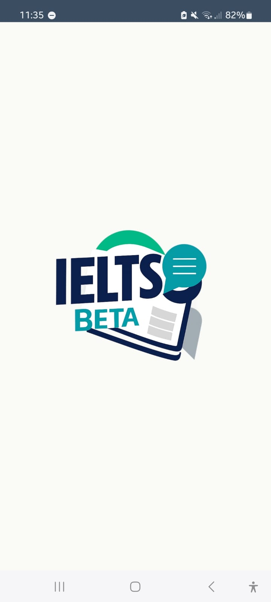
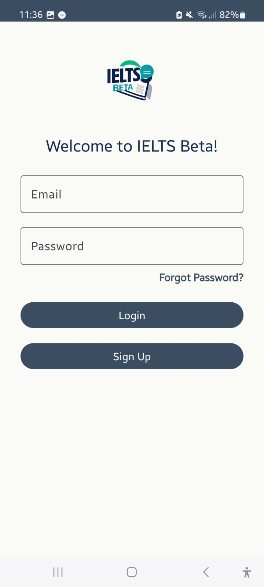
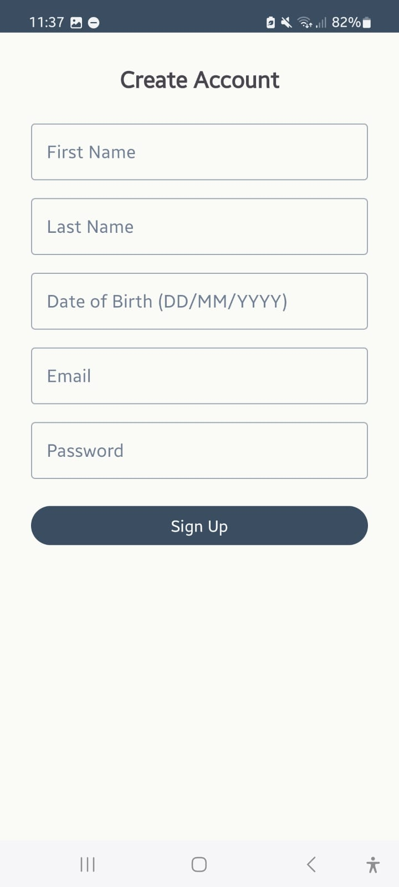
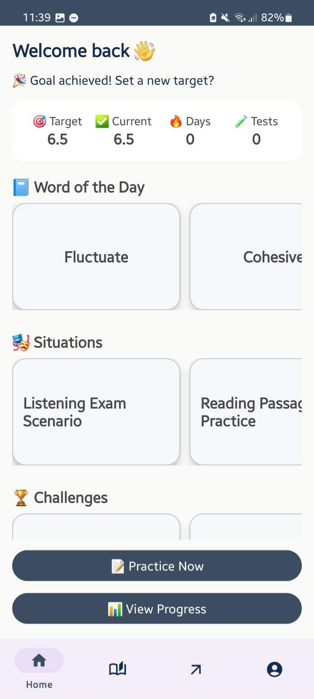
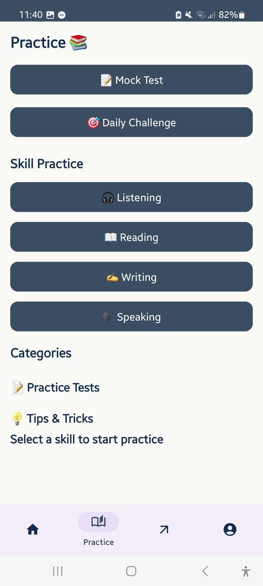
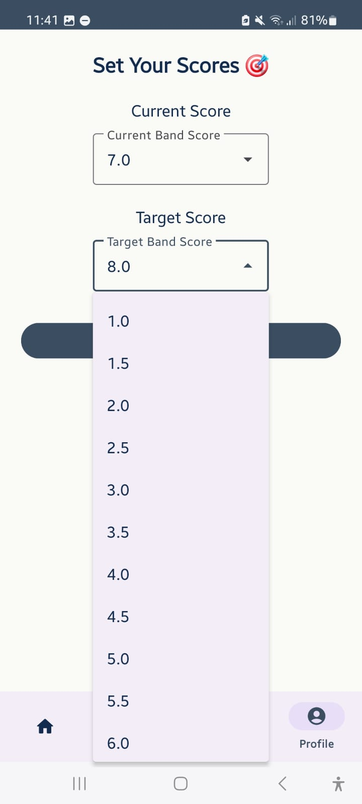
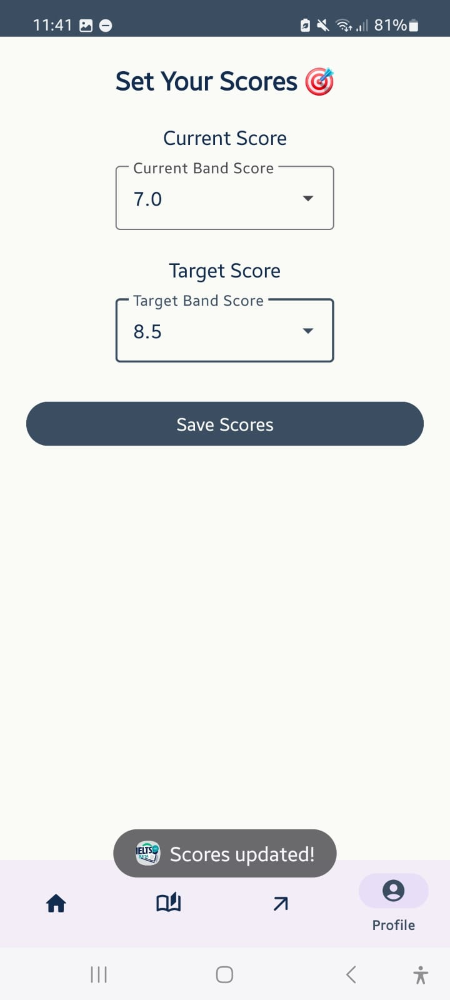

# IELTS Beta — Android App

**Personalized learning companion for IELTS preparation**  
Built using **Java**, **Android Studio**, and **Firebase Authentication**.

---

## 📁 Tech Stack

| Component | Technology |
|-----------|------------|
| Language | Java |
| Framework | Android Studio |
| Backend | Firebase Authentication & Realtime Database |
| UI | Android XML layouts, Material Design components |
| Data | Local JSON files for content cards |

--- 

## 📌 What is IELTS Beta?

IELTS Beta is a personalized learning companion designed to help students systematically prepare for the IELTS exam through **data-driven tracking** and **interactive resources**.  
The app provides a centralized platform where learners can manage their study goals and access high-quality educational content in one place.

---

## 🚀 Features

- **Secure Authentication & Cloud Syncing**  
  Users can **Sign Up and Login** securely with email and password using Firebase Authentication. All profiles and learning progress are saved in the cloud for seamless access across devices.  

- **Live Progress Dashboard**  
  Track **Target scores, Current scores, and study consistency (Days Active)** in real-time using Firebase Realtime Database.  

- **Visual Performance Analytics**  
  Animated **Circular Progress indicators** show overall advancement toward goals.  
  Skill-wise progress bars currently use placeholder values but will eventually sync with mock test data for precise performance tracking.  

- **Skill-Specific Modules**  
  Tailored practice sections for **Listening, Reading, Writing, and Speaking**.  
  Practice cards include curated YouTube tutorials and mock tests for better quality learning.  

- **Daily Interactive Learning**  
  Access to **Word of the Day** with definitions, contextual exam scenarios, and mini-challenges to encourage daily engagement.  

- **Goal-Oriented Planning**  
  Dedicated **Goal Setting interface** with score validation.  
  Goals are saved in Firebase and **update progress indicators in real-time** across Home and Progress tabs.  

- **Quick Access Buttons & Linked Entities**  
  Practice and Progress buttons under Home cards provide easy navigation, linking directly to modules or dashboards.  

---

## 📝 Notes / Important Details

- `google-services.json` is **not included** for security reasons.  
- Screenshots use **dummy data**; personal information is hidden.  
- Toast messages, filled forms, and minor UI states are **not shown** — only main screens and key functionality.  
- Practice cards, goals, and progress indicators are **linked entities** — actions in one place reflect elsewhere in real-time.  
- YouTube practice cards **redirect externally**; the app only shows links.  
- **Local JSON files** handle content cards; **Firebase** handles goal storage and real-time updates.  

---

## 🌟 Strengths of IELTS Beta

- **Secure and Reliable** — Firebase ensures accounts and progress are safely stored.  
- **Easy to Update** — App content like Word of the Day can be updated instantly.  
- **Clear Tracking** — Dashboard and progress bars provide an at-a-glance view of target score achievement.  
- **Smart Features** — Personalized greetings based on time of day.  
- **Helpful Resources** — Direct access to expert IELTS videos and practice tests on YouTube.  

---

## ⚠ Drawbacks

- Some buttons like **Mock Test** and **Daily Challenge** are currently inactive.  
- **Settings** like Light/Dark mode are not yet implemented.  
- Features such as **study reminders** and notifications are under construction.  

---

## 🔮 Future Developments

- **Fun Learning** — Add streak rewards for daily study sessions.  
- **AI Help** — AI chatbot to answer student questions 24/7.  
- **Better Study Tools** — Include Cambridge practice books, recorded lectures, and direct chat with IELTS instructors.  
- **Live Sessions** — Enable students to join live online classes from their coaching centers.  

---

## 🖼 Screenshots

### Splash Screen

### Login Screen

### Signup Screen

### Home 

### Practice Module

### Practice Skill Example

### Progress Screen

### Goal Setting 1

### Goal Setting 2

### Profile

---

## 📌 Notes / Important Details

- `google-services.json` is **not included** in this repository for security reasons.
- **Toast messages, filled forms, and minor UI states** are not shown — only main screens and key functionality.
- **Home stats card, goals, and progress indicators** are linked entities — actions in one place reflect in others (e.g., goals update progress tab in real time).
- **YouTube practice cards** redirect externally; the app shows only links.
- **Local JSON file** handles the content cards; **Firebase** handles goal storage and real-time updates.
